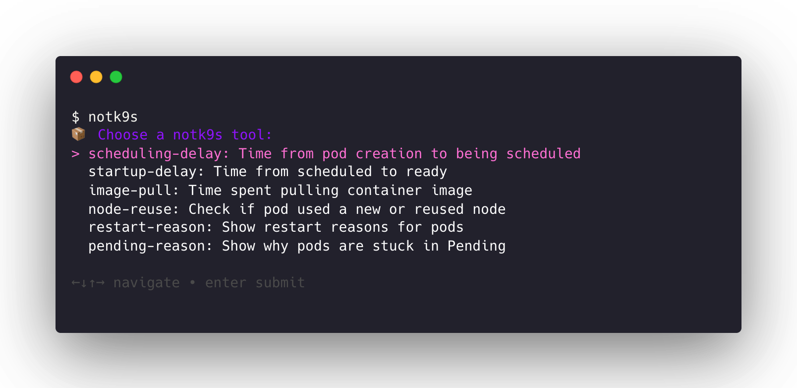

# notk9s
🐢 notk9s is a collection of lightweight Bash tools that fill in the gaps K9s doesn't — analyze pod delays, startup times, image pulls, node reuse, and more.



## ⚡ Quick Setup

To use `notk9s` anywhere, add this to your shell profile:

```bash
alias notk9s="/full/path/to/notk9s.sh"
````

Then reload your shell:

```bash
source ~/.zshrc  # or ~/.bashrc
```

Now just run:

```bash
notk9s
```

Or get help with:

```bash
notk9s --help
```
---

## 📄 License

This project is licensed under the [MIT License](LICENSE).